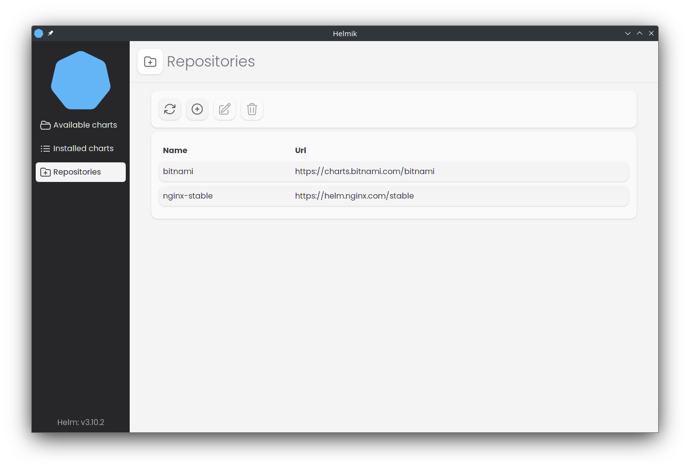

> **Warning**
> This project is in very early stage of development, currently my focus is to create first usable prerelease build
> 
## Table of contents

- [:grey_question: What is this?](#grey_question-what-is-this)
- [:blue_book: Licences](#blue_book-licences)
- [:camera: Screenshots](#camera-screenshots)

## :grey_question: What is this?

**Helmik** is a GUI wrapper for Helm

### Target platforms:
 - Windows
 - Linux
 - MacOS

## :blue_book: Licences

### Helmik can be used under two licences:

#### For personal use [PolyForm Noncommercial License 1.0.0](./LICENCE)

#### Internal Business Use [PolyForm Internal Use License 1.0.0](./LICENCE_INTERNAL_USE)

# :camera: Screenshots

